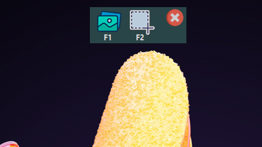

  

# Image-to-Text-.NET-Framework
### Current bugs
* start with windows feature doesn't read keyboard hooks (it fixes when i turn it off and on)
* If the window scale and layout is above 100%, half of the screenshot is taken. 
### Main Window
* language pack selection
* button to read text from the image you choose
* keyboard shortcut selection
* github project link

  

### ScreenShot Panel
* You can access this panel with the keyboard key you assigned from the main form.
* F1 displays the original image of the text that was last copied to memory
* F2 switches to new excerpt window (clicks anywhere on the screen while in this form)
* You can exit this form with 'esc'.

  

# Example
the results of a plain text document (background and text color compatible with reading)
it will show a notification when the text reading process is complete, if you click on the notification, it will create a file in the 'temp' folder and show the text copied to the memory
If we compare the results with the original text, it can be seen that tesseract ocr gives above average results.
### OUTPUT

  

  

  

